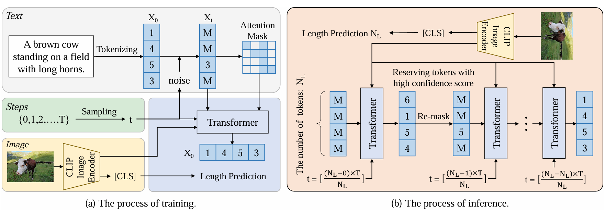
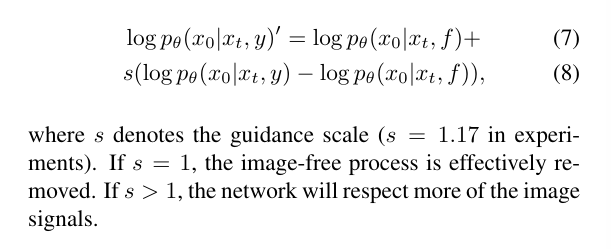
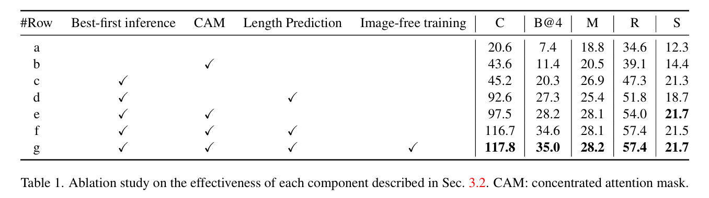

## Exploring Discrete Diffusion Models for Image Captioning

**发现于：**学长分享

**有关：**MASK形式离散扩散模型用于Caption任务

**模型结构：**

**扩散设计：**若前一时刻不为MASK，当前时刻依概率可能加噪成MASK，不变（当前token），其他token。若前一时刻为MASK，则后面都为MASK。

**训练：** 训练去噪网络，损失如$
\mathcal{L}_{x_0} = -\log p_\theta(x_0 \mid x_t, y)
$

**推理：**正常方式

### **特殊设计**

**① length prediction**

CLIP预测的[CLS]接了一个MLP来预测长度，并且在训练阶段使用交叉熵损失。如果没有长度作为已知的先验条件，那么其他方法都使用最大token长度来做生成，论文作者就说这方法能算是加速了。

**② concentrated attention mask**

因为MASK没信息，所以设计为(i)非MASK不需要依赖MASK，(ii)MASK不需要依赖其它MASK

**③ best-first inference**

在推理阶段，每次保留TOP-K个token，依照序列长度和时间步的关系计算。

**④ image-free training**

灵感来自于CFG技术，依 $p = 0.2$ 将图像特征替换为可训练的embedding。

测试阶段probability likelihood计算如下，其实就跟CFG如出一辙：

### **实验**

**数据集：**

*COCO* 数据集（123287张图，每个图5个captions）

*50257* 的vocabulary size

句子最长为 *20* 个字符

$weight decay = 0.01，lr 线性增长至 2e-4 然后cos调度至 0.\\训练30轮，5轮的warmup，512的batch size$

**网络结构和预训练：**

从预训练CLIP中提取出的 *ViT-B/16* 作为image backbone。

预训练时采用合并了COCO、Conceptual Captions、SBU、Visual Genome的结合形式的数据集，总计 *4 million* 的图像，*10 million* 的有关Captions。

这部分说为了跟sota方法比先在ViT-L/16上预训练训了15轮，diffusion model预训练时的peak lr是1e-4，batchsize是1024，微调时的学习率是1e-5，batchsize是512，image encoder的学习率是0.07倍的diffusion model的学习率。（没看懂为啥两个部分都说了这个训练配置但是又不一样，可能跑了两种实验

**分析：**

这部分说鉴于计算资源的考虑，所有ablation study除非特别说明都固定了image encoder，没有用image-free技术，没有预训练，结果是在验证集上的。

Table 1为消融实验结果，其实大部分技术都与MASK方法息息相关。

实验部分可以看出t embedding的设计和Image-free training的设计对结果影响不大（个人理解，不过其他设计都不赖

