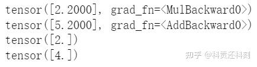
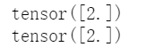
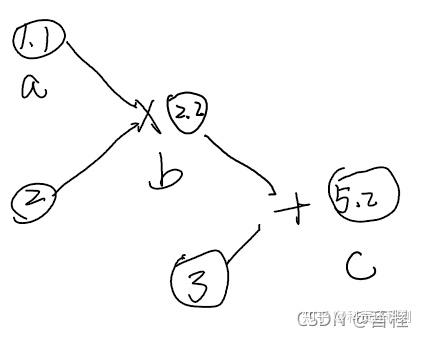
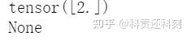
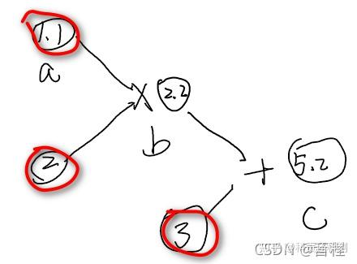
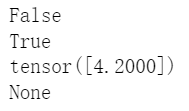
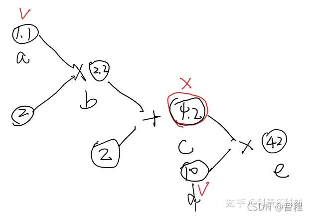

## 梯度

1. **默认**创建tensor的话requires_grad=False

2. requires_grad=True的tensor可backward()，具体根据计算图进行

3. 设置需要梯度的tensor可以看作parameter

4. **zero_grad**

   ```python
   a = torch.tensor([1.1], requires_grad=True)
   b = a * 2
   print(b)
   c = b + 3
   print(c)
   b.backward(retain_graph=True)#计算图在backward一次之后默认就消失，我们下面还要backward一次，所以需要retain_graph=True保存这个图。
   print(a.grad)
   c.backward()
   print(a.grad)
   ```

   

   

   我们发现，b对a的梯度是2没有错，但是c对a的梯度是4，有错。这是因为没有对梯度进行清0，不清零的话，默认进行梯度叠加，Pytorch不设置自动清零，所以我们需要手动清零，如下。

   ```python
   a = torch.tensor([1.1], requires_grad=True)
   b = a * 2
   c = b + 3
   b.backward(retain_graph=True)
   print(a.grad)
   a.grad.zero_()#tensor分为a.data和a.grad。这两个都是tensor。
   #所以也可以a.grad=torch.tensor([0.0])
   c.backward()
   print(a.grad)
   ```

   

5. **计算图**

   以上面这个代码为例，其计算图如下：

   

   

   我们再来做一个实验，c对b的梯度是多少？很多人直接说1，但是在Pytorch中这个不允许计算。

   

   ```text
   a = torch.tensor([1.1], requires_grad=True)
   b = a * 2
   c = b + 3
   c.backward()
   print(a.grad)
   print(b.grad)
   ```

   

   而且还发出了警告提示信息：

   > UserWarning: The .grad attribute of a Tensor that is not a leaf Tensor is being accessed. Its .grad attribute won't be populated during autograd.backward(). If you indeed want the gradient for a non-leaf Tensor, use .retain_grad() on the non-leaf Tensor. If you access the non-leaf Tensor by mistake, make sure you access the leaf Tensor instead. See [http://github.com/pytorch/pytorch/pull/30531](https://link.zhihu.com/?target=http%3A//github.com/pytorch/pytorch/pull/30531) for more information.

   这是因为在Pytorch中不会对非叶子节点保存梯度，但是根据求导的链式法则，计算梯度肯定要。我们仔细观察上面那个计算图，只有如下是叶子节点

   

   

   进一步，在Pytorch中只会对变量a求梯度，而2,3是常量。所以我们只得到了变量a的梯度。

   

   拿神经网络举个例子，变量a就相当于神经网络中的参数（需要求梯度并且更新），那些常量就相当于你的输入，不要计算梯度，自然也不需要更新。

6. **with torch.no_grad()** 和 **backward()**

   ```text
   a = torch.tensor([1.1], requires_grad=True)
   b = a * 2
   with torch.no_grad():
       c = b + 2
   print(c.requires_grad)
   d = torch.tensor([10.0], requires_grad=True)
   e = c * d
   print(e.requires_grad)
   e.backward()
   print(d.grad)
   print(a.grad)
   ```

   

   

   

   我们根据前面所学的知识，推导出前3个结果应该已经没有问题了，但是第4个怎么解释呢？很简单一句话，在计算图中，非叶子节点`c`作为“中间人”，如果其`requires_grad=False`，那么其前面的所有变量都无法反向传播，自然也就没有梯度，相当于卡住了。


**参考：**

[通俗讲解Pytorch梯度的相关问题]: https://zhuanlan.zhihu.com/p/416083478

